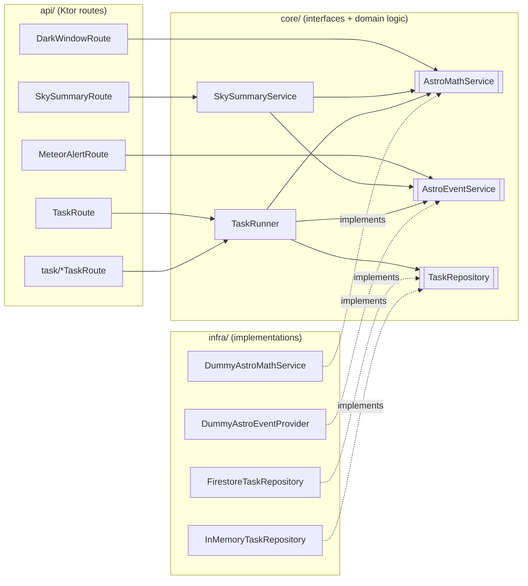
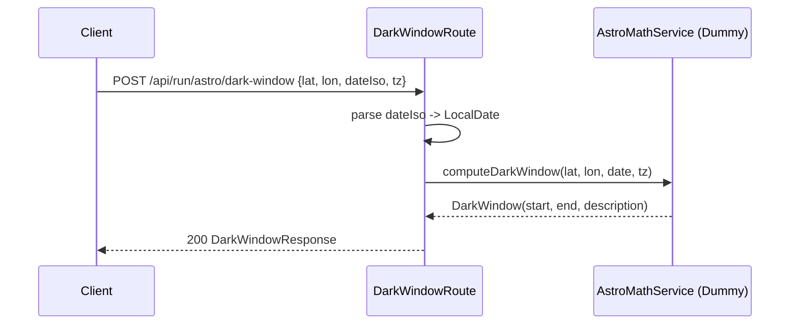
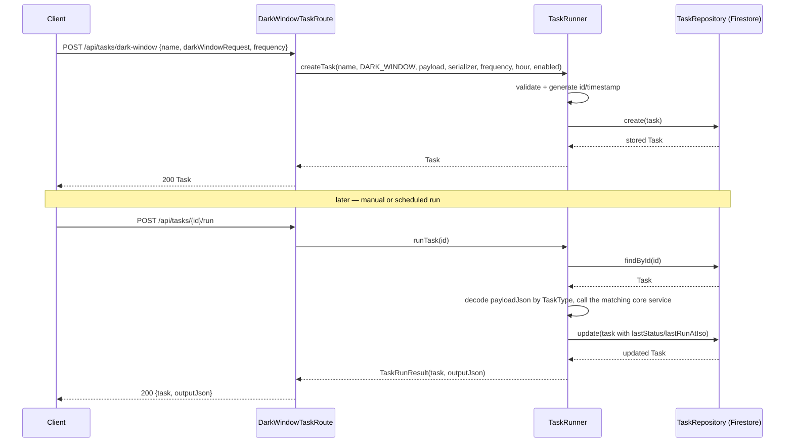
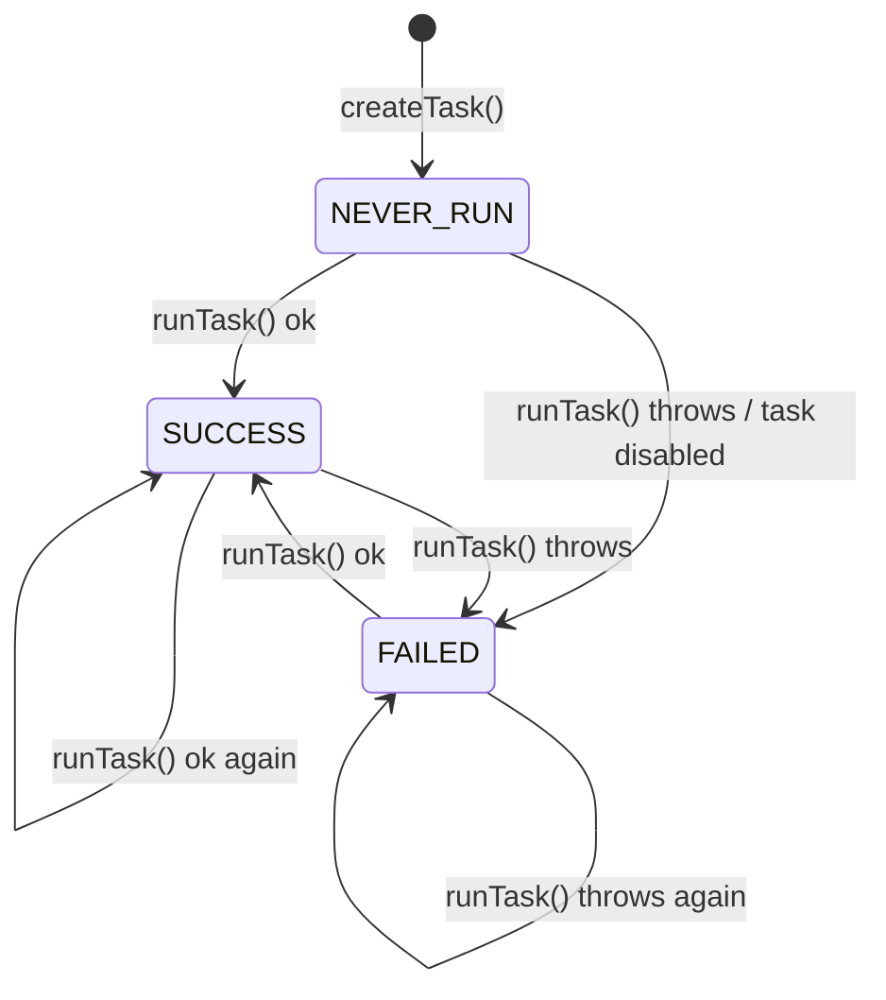
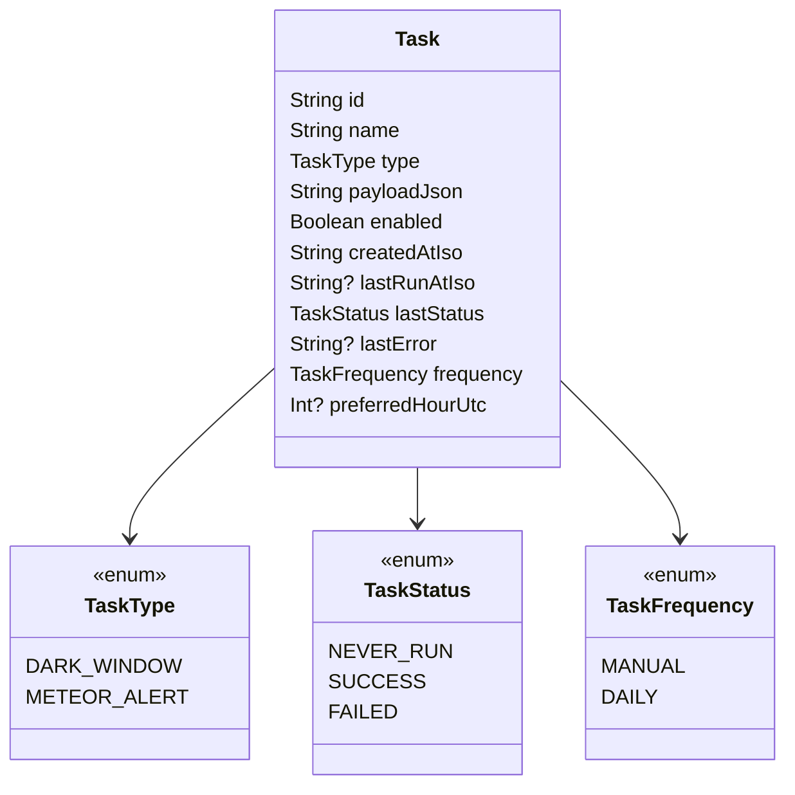
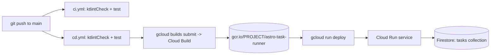

# Architecture

Astro Task Runner is a single Ktor service with a conventional three-layer
split (`api` / `core` / `infra`) and no framework-level dependency
injection — dependencies are built once in `Application.kt` and passed
around as a plain `ServiceRegistry`. This doc covers layering, the request
lifecycle, the task data model, and how it's deployed. For known problems
and a prioritized fix list, see `CLAUDE.md`. For naming/style rules and
where the code currently deviates from them, see `CONVENTIONS.md`.

## Layers

```
com.github.ioj0230.astro
├── api/                 HTTP layer — Ktor route functions
│   ├── DarkWindowRoute.kt, MeteorAlertRoute.kt, SkySummaryRoute.kt
│   │     "run now" endpoints: receive a request, call a core service, respond
│   ├── TaskRoute.kt     list / get / run / tick task endpoints
│   └── task/            per-task-type creation endpoints + request DTOs
│
├── core/                Domain layer — plain Kotlin, no Ktor/Firestore imports
│   ├── darkwindow/      DarkWindow, DarkWindowRequest/Response
│   ├── math/            AstroMathService interface
│   ├── meteor/          AstroEventService interface, MeteorShowerEvent, DTOs
│   ├── sky/             SkySummaryService (orchestrates math + meteor), DTOs
│   └── task/            Task, TaskType, TaskRepository interface, TaskRunner
│
├── infra/               Implementations of core interfaces — the only layer
│   │                    allowed to know about external systems
│   ├── math/            DummyAstroMathService     (placeholder calculations)
│   ├── meteor/          DummyAstroEventProvider    (hardcoded showers)
│   └── task/            FirestoreTaskRepository (prod), InMemoryTaskRepository (tests)
│
└── Application.kt       Ktor module setup + manual wiring (ServiceRegistry)
```

**Dependency direction is one-way: `api → core ← infra`.** `core` defines
interfaces (`AstroMathService`, `AstroEventService`, `TaskRepository`);
`infra` implements them; `api` only ever talks to `core` types. This is
what lets `TaskRunnerSchedulingTest` swap in `InMemoryTaskRepository` and
stub services without touching Ktor at all. The one place this boundary is
currently *not* respected for tests is route-level integration tests,
which go through `Application.module()` and therefore always get the real
`FirestoreTaskRepository` — see `CLAUDE.md` → Known gaps #1.



## Wiring: `ServiceRegistry`

`Application.module()` builds every dependency once, by hand, in order:

```kotlin
val astroMathService  = DummyAstroMathService()
val astroEventService = DummyAstroEventProvider()
val skySummaryService = SkySummaryService(astroMathService, astroEventService)
val firestore         = FirestoreOptions.getDefaultInstance().service
val taskRepository    = FirestoreTaskRepository(firestore, json)
val taskRunner        = TaskRunner(taskRepository, astroMathService, astroEventService, skySummaryService, json)
```

...and bundles them into a `ServiceRegistry` data class passed into every
route function (`darkWindowRoute(services)`, `taskRoute(services)`, ...).
There is no request-scoped or lazy resolution — everything is a singleton
built at startup. That's the right amount of machinery for this project's
size; introducing a DI framework here would be solving a problem the
codebase doesn't have (see *A Philosophy of Software Design* on avoiding
unnecessary complexity — the manual registry is simpler to read top-to-
bottom than any framework's annotation graph would be at this scale).

## Request lifecycle: "run now" endpoints

`/api/run/astro/*` compute and return a result immediately with no
persistence. Example — `POST /api/run/astro/dark-window`:



`SkySummaryRoute` is the same shape but fans out to both
`AstroMathService` and `AstroEventService` via `SkySummaryService`, which
also builds the human-readable `overallSummary` string.

## Request lifecycle: task endpoints

Tasks add a persistence + scheduling layer on top of the same domain
services. A task stores its request payload as a JSON string
(`Task.payloadJson`) tagged with a `TaskType`, so `TaskRunner` knows how to
decode and dispatch it later.



`POST /api/tasks/tick` is the same `runTask` path, just invoked for every
task where `isDue(task, now)` is true (see the state diagram below). It's
the endpoint an external scheduler (Cloud Scheduler, cron) is meant to
hit periodically — currently unauthenticated (`CLAUDE.md` → Known gaps #5).

## Task lifecycle



Scheduling (`TaskRunner.isDue`) is deliberately simple: `MANUAL` tasks are
never picked up by `tick`; `DAILY` tasks run once `now.hour >=
preferredHourUtc` and haven't already run that UTC calendar day. There's
no `HOURLY`/`WEEKLY`/cron-expression support yet (`TaskFrequency` has a
`TODO` marking exactly this). A `Clock` is injected into `TaskRunner`
specifically so this logic is deterministically testable
(`TaskRunnerSchedulingTest` fixes the clock rather than sleeping or mocking
`Instant.now()`).

Only `DARK_WINDOW` and `METEOR_ALERT` run through the persisted task path
today; `SkySummaryService` has no task-route equivalent yet.

## Data model



`payloadJson` is an intentional trade-off: it lets `Task` stay one flat,
storage-friendly shape regardless of task type, at the cost of losing
compile-time type safety on the payload (decoding picks the right
`KSerializer` at runtime based on `TaskType`, see `TaskRunner.runTask`'s
`when`). For two task types this is fine; if the type count grows much
further, revisit whether a sealed-class payload with polymorphic
serialization pays for its own complexity (see *Designing Data-Intensive
Applications*, ch. 4, on the schema-evolution trade-offs of
schema-on-read vs. schema-on-write — this is exactly that trade-off in
miniature).

## Persistence

`FirestoreTaskRepository` stores each `Task` as one document in a flat
`tasks` collection, keyed by `Task.id` (a random UUID), with the entire
task serialized into a single `taskJson` string field rather than mapped
to native Firestore fields. That means Firestore is being used purely as a
document blob store — no querying by `type`, `enabled`, or `frequency` is
possible without pulling every document (`findAll()` does exactly that: no
filtering, no pagination). Acceptable at hobby scale; the first thing to
change if task volume ever grows is to store real fields instead of a JSON
blob, so Firestore's query capabilities are usable
(`collection.whereEqualTo("enabled", true)` instead of loading everything
into memory to filter with `isDue`).

`InMemoryTaskRepository` implements the same interface for tests
(`TaskRunnerSchedulingTest`) via a `ConcurrentHashMap`. It is **not** wired
into `Application.module()` — production always uses Firestore.

## Deployment



- **Build**: multi-stage `Dockerfile` — `eclipse-temurin:21-jdk` builds a
  shadow/fat jar (`./gradlew clean shadowJar`), `eclipse-temurin:21-jre`
  runs it. No dev dependencies ship in the runtime image.
- **CI** (`ci.yml`): on every push/PR to `main`, runs `ktlintCheck` then
  `test`. No GCP credentials are configured here — which is exactly why
  the Firestore-backed integration tests are fragile in this workflow
  (`CLAUDE.md` → Known gaps #1).
- **CD** (`cd.yml`): on push to `main`, lints + tests again, authenticates
  to GCP via a service account (`GCP_SA_KEY` secret), builds with Cloud
  Build, and deploys to Cloud Run with `--allow-unauthenticated`. There's
  also a `deploy.ps1` for manual local deploys with the same three steps
  (test → build → deploy) — useful as a fallback if Actions is down, but
  it will drift from `cd.yml` if only one gets updated. Prefer editing
  both, or retiring `deploy.ps1` in favor of `gh workflow run` once that's
  not a concern.
- **Runtime config**: Cloud Run's service identity needs Firestore access
  (via ADC) at runtime; there is no `.env` / secrets file in the repo —
  everything server-side comes from the GCP service account's IAM roles.
