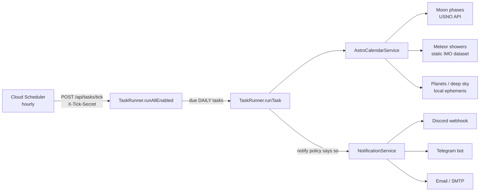

# Roadmap: sky calendar + notifications

This is the plan of record for where the project is going and why, and
the list of known gaps in what exists today. Use it alongside
`docs/ARCHITECTURE.md`, which covers how the code fits together. When a phase ships, mark it done
here and log it in `CHANGELOG.md`.

## The goal in one paragraph

Get an "AstroCalendar" style digest of the sky without having to go
looking for it. The model is the posters astronomy societies publish:
moon phases, meteor showers, oppositions, close approaches, and "X is well
placed". The digest should land in **Discord, Telegram, and email** on a
schedule. Every event says where it came from, so placeholder data can
never pass for verified data.

## How the pieces fit (target state)

Two rules hold up this design:

- **Providers are additive.** `AstroCalendarService` merges any number of
  `AstroCalendarProvider`s, so a new data source never touches the
  existing ones. Moving from dummy data to real data means swapping
  providers one at a time.
- **Channels are isolated.** `NotificationService` sends to every
  configured `Notifier` independently. A broken Telegram token never
  blocks the Discord or email copy, and never fails the task.

## Phases

### Phase 1: notifications, run history, calendar shape (built, in review)

- `Notifier` interface plus Discord, Telegram, and email (SMTP)
  implementations. Each channel is configured by env vars, and unset
  channels are skipped. See `docs/SETUP.md` § 9.
- `POST /api/notifications` sends a test message to every channel.
- A `notify` policy on every task: `NEVER`, `ON_FAILURE`, or `ALWAYS`.
- Run history: every run is stored with its error, output, and
  per-channel delivery results (`docs/SETUP.md` § 10).
- `AstroCalendarEvent` (date, category, title, details, **source**), the
  `AstroCalendarProvider` interface, `GET /api/calendar/events`, and the
  `ASTRO_CALENDAR` task type.
- `DummyAstroCalendarProvider` holds **October 2026 only**, copied from
  the UP AstroSoc poster to pin down the format end to end. Its events
  carry `source: "dummy: ..."`.
- Calendar providers fail independently (see "When a data source fails"
  below).

### Phase 1b: get it running in the cloud (ops, needs billing)

Nothing here is code. CD has been failing since 2026-09-20 because the
GCP project's billing account is **closed** (Cloud Build: "The billing
account for the owning project is disabled in state closed").

1. Link an active billing account to the project (see "Do we need to pay?"
   below). Then re-run the latest CD workflow.
2. Set the notification secrets on Cloud Run (`docs/SETUP.md` § 9).
3. Set `TASK_RUNNER_TICK_SECRET` and create the hourly Cloud Scheduler
   job (`docs/SETUP.md` § 8).
4. Smoke test: `POST /api/notifications`, then create a DAILY
   `astro-calendar` task with `"notify": "ALWAYS"` and wait for the next
   tick. Check `GET /api/tasks/{id}/runs` afterwards.
5. Turn on the run-history TTL policy (`docs/SETUP.md` § 10).

### Phase 2: real moon phases from a verified source

- Add a `UsnoMoonPhaseProvider` (infra) that calls the US Naval
  Observatory Astronomical Applications API: moon phases by year, no API
  key.
- USNO returns times in UT. Convert each one to a local **date** in the
  request's `timeZoneId` before building `AstroCalendarEvent`. A
  late-evening UT phase can land on the next day in Asia/Manila.
- Cache per year. Phases don't change, and a tick shouldn't hit an
  external API every hour.
- Follow "When a data source fails" below: a timeout, one retry, and a
  Firestore cache of the year's phases. Provider isolation already
  exists in `AstroCalendarService`.
- Keep an offline fallback in mind. A standard lunar phase algorithm
  (Meeus, *Astronomical Algorithms* ch. 49) is accurate to minutes and
  needs no network. If USNO turns out unreliable, it's a drop-in
  replacement behind the same interface.
- Remove the moon phases from `DummyAstroCalendarProvider` once this lands.

### Phase 3: full-year meteor shower dataset

- The International Meteor Organization (IMO) publishes a yearly Meteor
  Shower Calendar but has no JSON API. Copy each year's major showers
  into a static resource file (`src/main/resources/meteor-showers/2026.json`
  or similar). Record the IMO calendar edition in `source`.
- Use it in both `AstroCalendarProvider` (calendar events) and
  `AstroEventService` (the existing meteor-alert endpoint), then delete
  the hardcoded Perseids/Geminids.

### Phase 4: planets, close approaches, "well placed"

- Compute these locally rather than scraping them. An ephemeris library
  works offline. Astronomy Engine (MIT licensed, has a Kotlin port) is
  the first candidate, but check its current artifact and version before
  adding it. JPL Horizons is the authoritative reference for
  cross-checking results, but it's too heavy to call on every tick.
- "Well placed" depends on **latitude**. Define it as "above N° altitude
  at 21:00 local time" for the observer's coordinates. That means the
  calendar request gains `latitude`/`longitude`, as the other requests
  already have.

### Phase 5: real dark window

Real sunset/sunrise, astronomical twilight and moon illumination instead
of the fixed 20:00–03:00 window. Phases 2 and 4 build most of the
ingredients. Model it around what a photographer needs to decide *when to
shoot* (Bortle-scale light pollution, moon illumination %, not just "is
the sun down"). *Capturing the Universe* (Woodhouse) and *The Beginner's
Guide to Astrophotography* (Shaw) are good references before
over-engineering the math.

### Later

- One generic `POST /api/tasks` with `type` in the body.
  `TaskRunner.createTask` is already generic, but there are three
  per-type creation routes: shallow wrappers around one operation, the
  duplication *A Philosophy of Software Design* warns about.
- `/api/v1/` prefix before any external consumer.
- OIDC auth for `tick` instead of the shared secret.

## Data sources

| Source | Gives us | Access | Trust | Plan |
|---|---|---|---|---|
| **USNO Astronomical Applications API** (aa.usno.navy.mil) | Moon phases; sun/moon rise, set, and twilight | Free HTTPS JSON, no key | US Naval Observatory | Phase 2. Endpoint shapes not yet verified: the dev sandbox's proxy blocked the host, so confirm against the live docs when implementing. |
| **IMO Meteor Shower Calendar** (imo.net) | Shower dates, peaks, ZHR | Yearly PDF, no API | The reference source for meteor data | Phase 3: static dataset, refreshed yearly |
| **Astronomy Engine** (local library) | Planet positions, oppositions, conjunctions, object altitude | Offline, no network | Validated against JPL Horizons | Phase 4 |
| **JPL Horizons API** | Authoritative ephemerides | Free HTTPS, rate limited | NASA/JPL | Cross-checking only |
| Society posters (e.g. UP AstroSoc) | Format reference | Images and social posts | Curated, but not machine-readable | **Not a data source.** Scraping images breaks easily, the content isn't ours to republish, and it would always be a month behind. Used only as the format reference and October 2026 dummy data. |

## When a data source fails

Every external API will be down sometimes. The rule is: **one bad source
costs you that source's events, never the whole digest, and never
silently.** In layers, from what already exists to what each network
provider must add:

1. **Isolation (done, `AstroCalendarService`).** A provider that throws
   is left out and named in `unavailableSources`. The digest says
   "⚠️ Incomplete — unavailable right now: USNO moon phases". If *every*
   provider fails, the run fails instead of claiming a quiet sky, which
   records a FAILED run and alerts `ON_FAILURE` tasks.
2. **Timeouts (per provider).** Short ones, around 5–10 s. The shared
   Ktor client has a 10 s request timeout; a provider can set its own.
   A hung API must not hold up the tick.
3. **One retry, only for transient errors.** Retry once after a short
   pause on a timeout or a 5xx. Never retry a 4xx: that's our bug or a
   changed API, and retrying just repeats it.
4. **Cache what doesn't change.** Moon phases and meteor-shower dates
   for a year are fixed. Fetch them once, store them in Firestore (e.g.
   `calendar_cache/usno-moon-2026`), and read from there. An outage then
   only matters on the one day a year you refresh.
5. **Serve stale over nothing.** If a refresh fails but a cached copy
   exists, use it and say so in `source` (e.g. "USNO (cached
   2026-09-30)").
6. **Notice persistent failure.** Each incomplete digest is already in
   the run history. If one becomes routine, the next step is a "N
   incomplete runs in a row" alert. Not built yet; don't build it before
   the first real provider exists.

What we deliberately skip: circuit breakers and retry libraries. With
one call per source per hour at most, a timeout and a single retry
already cover what those would.

## Rules for adding a provider

1. Implement `core.calendar.AstroCalendarProvider` in `infra/calendar/`
   and register it in `Application.module()`'s `AstroCalendarService(...)`
   list. Nothing else changes.
2. Always set `source` to a name a human can check, such as "USNO" or
   "IMO 2026 calendar". Prefix it with `dummy:` for anything unverified.
3. Return **local dates in the requested zone**, not UT dates.
4. Give it a `name`; that's what users see when it's unavailable.
5. Follow "When a data source fails": timeout, one retry on transient
   errors, cache anything that doesn't change.
6. Test it with a fixed `Clock` and, for HTTP clients, Ktor's `MockEngine`
   (see `HttpNotifiersTest`), including a failing case. Tests must never
   call the real API.

## Known gaps

What's wrong or missing **today**, as opposed to the phases above, which
are planned work. When a gap is fixed, delete it here and record the fix
in `CHANGELOG.md`.

1. **All astronomy is placeholder.** `DummyAstroMathService` assumes a
   fixed 20:00–03:00 dark window and derives "moon phase" from the day of
   the month. `DummyAstroEventProvider` knows only Perseids and Geminids.
   `DummyAstroCalendarProvider` holds October 2026 only, copied from a
   society poster and unverified. Never describe these as working
   astronomy without the "dummy" caveat. Phases 2–5 replace them.
2. **DAILY dark-window and meteor-alert tasks repeat the same date.**
   Their payloads store a fixed `dateIso`, so every daily run reports the
   creation date. `ASTRO_CALENDAR` avoids this by leaving `startDateIso`
   null ("today, resolved when the task runs"). Apply the same pattern
   (`dateIso: String? = null` → today in `timeZoneId`) to the other two
   before relying on them for daily notifications.
3. **The GCP billing account is closed.** CD has failed at the Cloud
   Build step since 2026-09-20, so `main` isn't deployed. Ops fix:
   `docs/RUNBOOKS.md` runbook 1.
4. **Three task-creation routes for one operation**
   (`/api/tasks/dark-window`, `/meteor-alert`, `/astro-calendar`). See
   "Later" above.
5. **No API versioning, and two route-naming schemes**
   (`/api/run/astro/*` vs `/api/tasks/*`). Not urgent with no external
   consumers, but don't add a third. See `docs/CONVENTIONS.md`.
6. **`FirestoreTaskRunRepository`'s query isn't tested.** The field
   mapping and the behavior (via `InMemoryTaskRunRepository`) are, but
   the `orderBy`/`limit` query only runs against real Firestore. A
   Firestore emulator in CI would close this.
7. **Error handling is deliberately narrow.** `StatusPages` maps the
   exceptions this code actually throws to 4xx; anything else is a
   generic, non-leaky 500. That's the right default, not exhaustive input
   validation.

## Do we need to pay?

- **Coding: no.** Building and testing need nothing from GCP. The test
  suite runs against `InMemoryTaskRepository` and fake notifiers.
- **Deploying: you need an active billing account linked**, but expect a
  hobby setup like this to cost nothing or close to it. Cloud Run, Cloud
  Build, Firestore, Cloud Scheduler, and Secret Manager each have a free
  tier, and one hourly tick plus a few tasks sits well inside them. Check
  the current free-tier limits on each product's pricing page; they
  change. **Set a budget alert** (Billing → Budgets & alerts, e.g. $1) when
  you re-link billing, so a mistake shows up as an email and not as a bill.
- All three notification channels are free: Discord webhooks, the Telegram
  Bot API, and Gmail SMTP with an App Password.
